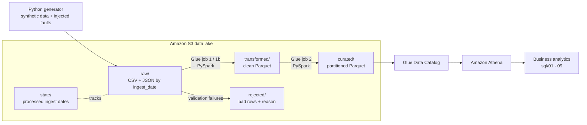

# FinSight: Financial Data Lake & Analytics Platform

An end-to-end **batch data engineering pipeline** on AWS. Raw financial data (customers, accounts,
transactions, investments) lands in an S3 data lake, is cleaned and validated with **PySpark**,
stored as **partitioned Parquet**, catalogued in the **AWS Glue Data Catalog**, and queried with
**Amazon Athena**. The pipeline processes **1.26 million transactions**, supports **incremental
loads**, and cuts Athena data scanned by **57-89 %** through partitioning and query design.

## Highlights

| | |
|---|---|
| Volume | 1,263,600 valid transactions (1,313,000 raw rows incl. duplicates, across two batches) plus 20k customers, 50k accounts, 30k investments |
| Architecture | raw -> transformed -> curated layers on S3, plus `rejected/` for bad records |
| ETL | PySpark: cleaning, deduplication, validation, referential checks, joins, aggregations |
| Storage | Snappy Parquet, partitioned by `year/month` |
| Incremental | state-tracked by `ingest_date`; only new batches processed, only affected months rewritten; idempotent reruns |
| Athena scan reduction | 88.8 % / 77.5 % / 57.1 % on 3-, 6-, 9-month queries (identical results verified) |
| Analytics | 9 business queries in `sql/` |

## Architecture



Layers:

| Layer | Contents |
|---|---|
| `raw/<dataset>/ingest_date=YYYY-MM-DD/` | Untouched source files, exactly as received |
| `transformed/` | Typed, standardized, deduplicated, validated Parquet (`transactions` partitioned by `year/month`) |
| `curated/` | Analytics-ready tables: enriched fact table plus aggregates |
| `rejected/` | Rows that failed validation, with the original values, `reject_reason` and `source_file` |
| `state/` | Small JSON files recording which ingest dates each job has processed |

## Tech stack and why

| Tool | Role |
|---|---|
| Python, pandas, NumPy, Faker | Generate realistic synthetic data (vectorised NumPy for the 1M+ rows) |
| PySpark (Spark SQL) | Distributed ETL: cleaning, joins, aggregations, partitioned writes |
| Hadoop FileSystem layer | Spark's storage API; `winutils`/`hadoop.dll` make it work on Windows. S3 plays the role of distributed storage (no HDFS cluster was run) |
| Amazon S3 | Durable, cheap, scalable data lake storage |
| AWS IAM | Roles and policies: Glue reads/writes only the project bucket |
| AWS Glue | Serverless Spark to run the ETL jobs; Data Catalog for table metadata |
| Amazon Athena | Serverless SQL over Parquet in S3, billed per data scanned |
| Parquet (Snappy) | Columnar and compressed: Athena reads only the needed columns |
| SQL | Analytics queries and table definitions |
| AWS CLI / boto3 | Uploads, inspection and verification |

## Repository layout

```
data_gen/generate_data.py              synthetic data generator
jobs/lake_io.py                        helpers: local vs S3 paths, state files, Spark session
jobs/01b_small_tables_to_transformed.py   customers, accounts, investments -> transformed
jobs/01_raw_to_transformed.py          transactions -> transformed (incremental)
jobs/02_transformed_to_curated.py      transformed -> curated (incremental by month)
jobs/check_env.py                      environment smoke test
sql/00_setup_tables.sql                Athena DDL and the unpartitioned baseline table
sql/01..09_*.sql                       business analytics queries
benchmarks/                            benchmark queries and measured results
requirements.txt                       Python packages
```

## The data

Four datasets, generated by `data_gen/generate_data.py` (fixed seed 42):

| Dataset | Rows | Format |
|---|---|---|
| customers | 20,000 | JSON Lines |
| accounts | 50,059 | CSV |
| transactions (main) | 1,200,000 unique (+12,000 injected duplicates = 1,212,000 written), six chunk files, Jan 2025 - Jun 2026 | CSV |
| transactions (batch 2) | 100,000 unique (+1,000 duplicates), July 2026, held back for the incremental load | CSV |
| investments | 30,000 | CSV |

About 4.8 % of transaction rows get a deliberate fault: duplicates, blank amounts, invalid
dates, negative amounts, orphan account IDs, and messy category text. The generator records exact
counts in `fault_summary.json`, so the pipeline's detection can be checked precisely.

## ETL design

**Job 1: raw -> transformed (transactions)**
1. Read CSV with an explicit all-string schema (so bad values are caught, not silently nulled).
2. Deduplicate on `txn_id`.
3. Cast with `try_*` functions and flag invalid rows (`null_or_invalid_amount`,
   `non_positive_amount`, `invalid_date`, `orphan_account`).
4. Standardize text (`trim`, `upper`, `initcap`).
5. Write valid rows as Parquet partitioned by `year/month`; write rejected rows with the reason.
6. Reconcile: rows read = valid + rejected + duplicates removed.

**Job 1b:** the same pattern for customers, accounts, and investments (reads the latest
`ingest_date` snapshot).

**Job 2: transformed -> curated.** Joins transactions with accounts and customers, then builds:
`fact_transactions` (partitioned), `monthly_spend_by_customer` (partitioned),
`category_summary_monthly` (partitioned), `account_summary`, and `portfolio_summary`.

**Incremental processing.** Each job keeps a state file (`state/*.json`) of processed
`ingest_date`s. A run lists the available `ingest_date=` folders, processes only the new ones,
merges new rows into existing partitions (anti-join on `txn_id`, rewriting only the affected
months with dynamic partition overwrite), and updates the state **after** a successful write.
Rerunning the same batch changes nothing.

## Run it

### Prerequisites
Python 3.11, JDK 17, AWS CLI configured. On Windows, Spark also needs `winutils.exe` and
`hadoop.dll` (Hadoop 3.x build) in `C:\hadoop\bin`, with `HADOOP_HOME=C:\hadoop` and
`C:\hadoop\bin` on `PATH`.

```powershell
py -3.11 -m venv venv
.\venv\Scripts\Activate.ps1
pip install -r requirements.txt
python jobs\check_env.py          # Spark + Parquet round trip, AWS identity
```

### Local run
```powershell
python data_gen\generate_data.py            # add --small for a quick test
# arrange raw files as raw/transactions/ingest_date=YYYY-MM-DD/ ...
python jobs\01b_small_tables_to_transformed.py
python jobs\01_raw_to_transformed.py
python jobs\02_transformed_to_curated.py
```
All jobs default to `--base data` (local folder). Add a new batch under
`data/raw/transactions/ingest_date=<new date>/` and run jobs 01 and 02 again: only the new date
is processed.

### AWS run
1. **Bucket**: create an S3 bucket in your region (public access blocked).
2. **Upload raw data** (the dated prefix is what drives incremental loading):
   ```powershell
   $B = "<your-bucket>"; $D = "2026-10-07"
   aws s3 cp data\raw\customers    s3://$B/raw/customers/ingest_date=$D/    --recursive
   aws s3 cp data\raw\accounts     s3://$B/raw/accounts/ingest_date=$D/     --recursive
   aws s3 cp data\raw\transactions s3://$B/raw/transactions/ingest_date=$D/ --recursive
   aws s3 cp data\raw\investments  s3://$B/raw/investments/ingest_date=$D/  --recursive
   aws s3 cp jobs\lake_io.py s3://$B/scripts/lake_io.py
   ```
3. **IAM role for Glue** (trusted entity: Glue). Attach `AWSGlueServiceRole` plus an inline policy
   scoped to the bucket:
   ```json
   { "Version": "2012-10-17", "Statement": [
     { "Effect": "Allow", "Action": ["s3:GetObject","s3:PutObject","s3:DeleteObject"],
       "Resource": "arn:aws:s3:::<your-bucket>/*" },
     { "Effect": "Allow", "Action": ["s3:ListBucket","s3:GetBucketLocation"],
       "Resource": "arn:aws:s3:::<your-bucket>" } ] }
   ```
4. **Glue jobs**: create three Spark jobs from the scripts in `jobs/` with these settings.

   | Setting | Value |
   |---|---|
   | Glue version | 5.x (Spark 3.5+; the code uses `try_to_timestamp`) |
   | Worker type / count | G.1X x 2 |
   | Timeout / retries | 30 min / 0 |
   | Job bookmark | disabled (the jobs keep their own state) |
   | Python library path | `s3://<your-bucket>/scripts/lake_io.py` (the **file**, not the bucket) |
   | Job parameter | `--base` = `s3://<your-bucket>` |

   Run in order and wait for each to finish: **01b -> 01 -> 02**.
5. **Athena**: create a workgroup with a results location, then run `sql/00_setup_tables.sql`
   (replace `YOUR-BUCKET`). It creates the catalog tables and the unpartitioned baseline table.
6. **Incremental batch**: upload the next file to `raw/transactions/ingest_date=<new date>/`, run
   Glue jobs 01 then 02, then `MSCK REPAIR TABLE` on the partitioned tables.

## Results

### Athena: data scanned, baseline vs optimized
Baseline: unpartitioned Parquet filtered on `txn_date`. Optimized: partitioned table filtered on
`year`/`month`. Both read only the columns they need. Identical results were verified for every
pair. Details in [`benchmarks/benchmark_results.md`](benchmarks/benchmark_results.md).

| Query | Months scanned | Baseline | Optimized | Reduction |
|---|---|---|---|---|
| Spend by category | 3 of 19 | 7.52 MB | 0.84 MB | 88.8 % |
| Monthly volume by segment | 6 of 19 | 7.20 MB | 1.62 MB | 77.5 % |
| Top 10 customers | 9 of 19 | 9.36 MB | 4.01 MB | 57.1 % |
| Top 10 customers from the aggregate table | 9 of 19 | 9.36 MB | 1.38 MB | 85.2 % |

The saving grows as the query touches fewer months. Run times were 0.7-1.8 s for every query and
are not a reliable differentiator at this data size.

### ETL processing time

| Job | Local | AWS Glue (G.1X x 2) |
|---|---|---|
| Job 1 full load (1.21M rows read) | 22.3 s | 92 s |
| Job 1 incremental (101k rows read) | 14.2 s | 70 s |
| Job 1 rerun, nothing new | skipped | 37 s |
| Job 2 full build | 33.2 s | 94 s |
| Job 2 incremental (1 month) | 36.0 s | 88 s |

Incremental runs process 8 % of the rows and rewrite 1 of 19 partitions; the partition-rebuild
stages of Job 2 are about 3x faster (10.5 s vs 3.5 s). Wall-clock gains are modest at this size
because fixed costs (Spark/Glue start-up, lifetime aggregates) dominate.

### Data quality
In the main batch every injected fault was detected: 12,000 duplicates removed, 33,600 invalid
rows rejected, and 12,000 messy categories standardized. Batch 2 matched as well (1,000
duplicates, 2,800 rejected). Row-count reconciliation passed for both batches.

### Business analytics (`sql/`)
Monthly volume, month-over-month growth, top customers, category share, account-type cash flow,
segment profile, portfolio by segment, outlier transactions, and spend concentration. Example
findings on the synthetic data: Groceries is the largest category (17.9 % of spend); the top 10 %
of customers account for 31.8 % of spend.

## Limitations

* **Lifetime aggregates** (`account_summary`, `portfolio_summary`) are recomputed from the curated
  fact table on every run rather than updated incrementally.
* **Incremental merge** assumes a `txn_id` always belongs to the same month.
* **Partitions are registered with `MSCK REPAIR TABLE`** after each load; partition projection or
  a crawler would automate this.
* **Outlier query** uses a 3-sigma rule, which is crude for heavily skewed amounts.
* **Batch only.** No streaming, orchestration (Step Functions / Airflow), or automated tests.
* **Broad CLI permissions.** The Glue jobs run under a bucket-scoped role, but the IAM user driving
  the AWS CLI had administrator access in this sandbox; use a narrowly scoped policy beyond a
  personal project.

## Possible extensions

Orchestrate the jobs with Step Functions or Airflow, use Athena partition projection, add Great
Expectations-style data tests, convert to Iceberg tables for upserts, and add dashboards on top
of the curated tables.

## Cost note

Glue (per DPU-hour), Athena (per TB scanned, 10 MB minimum per query) and S3 storage are
billed. This project used 2 G.1X workers for 1-2 minute runs and queries that scan a few MB.
Delete test data and unused jobs when finished.
